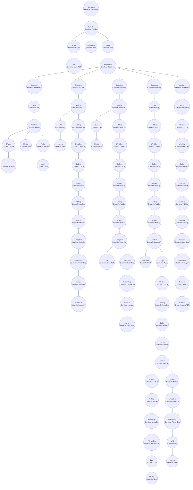

lab1/add.sy

```mermaid
graph TD
  0((CompUnit
ExtraInfo: CompUnit))
  0---1
  1((FuncDef
ExtraInfo: FuncDef))
  1---2
  2((BType
ExtraInfo: BType))
  2---3
  3((int 
ExtraInfo: basic AST))
  1---4
  4((Ident main
ExtraInfo: Ident))
  1---5
  5((Block
ExtraInfo: Block))
  5---6
  6((BlockItems
ExtraInfo: BlockItems))
  6---7
  7((BlockItem
ExtraInfo: BlockItem))
  7---8
  8((Decl
ExtraInfo: Decl))
  8---9
  9((VarDecl
ExtraInfo: VarDecl))
  9---10
  10((BType
ExtraInfo: BType))
  10---11
  11((int 
ExtraInfo: basic AST))
  9---12
  12((Ident a
ExtraInfo: Ident))
  9---13
  13((VarDef
ExtraInfo: VarDef))
  13---14
  14((Ident b
ExtraInfo: Ident))
  6---15
  15((BlockItem
ExtraInfo: BlockItem))
  15---16
  16((Assign
ExtraInfo: basic AST))
  16---17
  17((LVal
ExtraInfo: LVal))
  17---18
  18((Ident a
ExtraInfo: Ident))
  16---19
  19((LOrExp
ExtraInfo: LOrExp))
  19---20
  20((LAndExp
ExtraInfo: LAndExp))
  20---21
  21((EqExp
ExtraInfo: EqExp))
  21---22
  22((RelExp
ExtraInfo: RelExp))
  22---23
  23((AddExp
ExtraInfo: AddExp))
  23---24
  24((MulExp
ExtraInfo: MulExp))
  24---25
  25((UnaryExp
ExtraInfo: UnaryExp))
  25---26
  26((PrimaryExp
ExtraInfo: PrimaryExp))
  26---27
  27((Number
ExtraInfo: Number))
  27---28
  28((intconst 10
ExtraInfo: basic AST))
  6---29
  29((BlockItem
ExtraInfo: BlockItem))
  29---30
  30((Assign
ExtraInfo: basic AST))
  30---31
  31((LVal
ExtraInfo: LVal))
  31---32
  32((Ident b
ExtraInfo: Ident))
  30---33
  33((LOrExp
ExtraInfo: LOrExp))
  33---34
  34((LAndExp
ExtraInfo: LAndExp))
  34---35
  35((EqExp
ExtraInfo: EqExp))
  35---36
  36((RelExp
ExtraInfo: RelExp))
  36---37
  37((AddExp
ExtraInfo: AddExp))
  37---38
  38((MulExp
ExtraInfo: MulExp))
  38---39
  39((UnaryExp
ExtraInfo: UnaryExp))
  39---40
  40((sub 
ExtraInfo: basic AST))
  39---41
  41((UnaryExp
ExtraInfo: UnaryExp))
  41---42
  42((PrimaryExp
ExtraInfo: PrimaryExp))
  42---43
  43((Number
ExtraInfo: Number))
  43---44
  44((intconst 1
ExtraInfo: basic AST))
  6---45
  45((BlockItem
ExtraInfo: BlockItem))
  45---46
  46((Exp
ExtraInfo: Exp))
  46---47
  47((LOrExp
ExtraInfo: LOrExp))
  47---48
  48((LAndExp
ExtraInfo: LAndExp))
  48---49
  49((EqExp
ExtraInfo: EqExp))
  49---50
  50((RelExp
ExtraInfo: RelExp))
  50---51
  51((AddExp
ExtraInfo: AddExp))
  51---52
  52((MulExp
ExtraInfo: MulExp))
  52---53
  53((FunCall
ExtraInfo: basic AST))
  53---54
  54((Ident putint
ExtraInfo: Ident))
  53---55
  55((Args
ExtraInfo: Args))
  55---56
  56((LOrExp
ExtraInfo: LOrExp))
  56---57
  57((LAndExp
ExtraInfo: LAndExp))
  57---58
  58((EqExp
ExtraInfo: EqExp))
  58---59
  59((RelExp
ExtraInfo: RelExp))
  59---60
  60((AddExp
ExtraInfo: AddExp))
  60---61
  61((AddExp
ExtraInfo: AddExp))
  61---62
  62((MulExp
ExtraInfo: MulExp))
  62---63
  63((UnaryExp
ExtraInfo: UnaryExp))
  63---64
  64((PrimaryExp
ExtraInfo: PrimaryExp))
  64---65
  65((LVal
ExtraInfo: LVal))
  65---66
  66((Ident a
ExtraInfo: Ident))
  60---67
  67((MulExp
ExtraInfo: MulExp))
  67---68
  68((UnaryExp
ExtraInfo: UnaryExp))
  68---69
  69((PrimaryExp
ExtraInfo: PrimaryExp))
  69---70
  70((LVal
ExtraInfo: LVal))
  70---71
  71((Ident b
ExtraInfo: Ident))
  6---72
  72((BlockItem
ExtraInfo: BlockItem))
  72---73
  73((Return
ExtraInfo: basic AST))
  73---74
  74((LOrExp
ExtraInfo: LOrExp))
  74---75
  75((LAndExp
ExtraInfo: LAndExp))
  75---76
  76((EqExp
ExtraInfo: EqExp))
  76---77
  77((RelExp
ExtraInfo: RelExp))
  77---78
  78((AddExp
ExtraInfo: AddExp))
  78---79
  79((MulExp
ExtraInfo: MulExp))
  79---80
  80((UnaryExp
ExtraInfo: UnaryExp))
  80---81
  81((PrimaryExp
ExtraInfo: PrimaryExp))
  81---82
  82((Number
ExtraInfo: Number))
  82---83
  83((intconst 0
ExtraInfo: basic AST))
```
