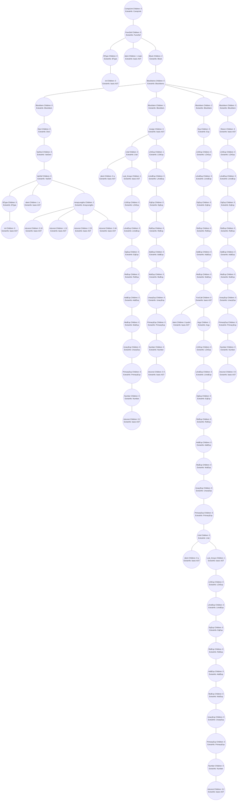

lab1/array1.sy

```mermaid
graph TD
  0((CompUnit Children: 0
ExtraInfo: CompUnit))
  0---1
  1((FuncDef Children: 0
ExtraInfo: FuncDef))
  1---2
  2((BType Children: 0
ExtraInfo: BType))
  2---3
  3((int Children: 0 
ExtraInfo: basic AST))
  1---4
  4((ident Children: 1 main
ExtraInfo: basic AST))
  1---5
  5((Block Children: 2
ExtraInfo: Block))
  5---6
  6((BlockItems Children: 0
ExtraInfo: BlockItems))
  6---7
  7((BlockItem Children: 0
ExtraInfo: BlockItem))
  7---8
  8((Decl Children: 0
ExtraInfo: Decl))
  8---9
  9((VarDecl Children: 0
ExtraInfo: VarDecl))
  9---10
  10((VarDef Children: 0
ExtraInfo: VarDef))
  10---11
  11((BType Children: 0
ExtraInfo: BType))
  11---12
  12((int Children: 0 
ExtraInfo: basic AST))
  10---13
  13((ident Children: 1 a
ExtraInfo: basic AST))
  10---14
  14((ArrayLengths Children: 2
ExtraInfo: ArrayLengths))
  14---15
  15((intconst Children: 0 10
ExtraInfo: basic AST))
  14---16
  16((intconst Children: 1 12
ExtraInfo: basic AST))
  14---17
  17((intconst Children: 2 23
ExtraInfo: basic AST))
  14---18
  18((intconst Children: 3 44
ExtraInfo: basic AST))
  6---19
  19((BlockItem Children: 1
ExtraInfo: BlockItem))
  19---20
  20((Assign Children: 0
ExtraInfo: basic AST))
  20---21
  21((LVal Children: 0
ExtraInfo: LVal))
  21---22
  22((ident Children: 0 a
ExtraInfo: basic AST))
  21---23
  23((Lval_Arrays Children: 1
ExtraInfo: basic AST))
  23---24
  24((LOrExp Children: 0
ExtraInfo: LOrExp))
  24---25
  25((LAndExp Children: 0
ExtraInfo: LAndExp))
  25---26
  26((EqExp Children: 0
ExtraInfo: EqExp))
  26---27
  27((RelExp Children: 0
ExtraInfo: RelExp))
  27---28
  28((AddExp Children: 0
ExtraInfo: AddExp))
  28---29
  29((MulExp Children: 0
ExtraInfo: MulExp))
  29---30
  30((UnaryExp Children: 0
ExtraInfo: UnaryExp))
  30---31
  31((PrimaryExp Children: 0
ExtraInfo: PrimaryExp))
  31---32
  32((Number Children: 0
ExtraInfo: Number))
  32---33
  33((intconst Children: 0 2
ExtraInfo: basic AST))
  20---34
  34((LOrExp Children: 1
ExtraInfo: LOrExp))
  34---35
  35((LAndExp Children: 0
ExtraInfo: LAndExp))
  35---36
  36((EqExp Children: 0
ExtraInfo: EqExp))
  36---37
  37((RelExp Children: 0
ExtraInfo: RelExp))
  37---38
  38((AddExp Children: 0
ExtraInfo: AddExp))
  38---39
  39((MulExp Children: 0
ExtraInfo: MulExp))
  39---40
  40((UnaryExp Children: 0
ExtraInfo: UnaryExp))
  40---41
  41((PrimaryExp Children: 0
ExtraInfo: PrimaryExp))
  41---42
  42((Number Children: 0
ExtraInfo: Number))
  42---43
  43((intconst Children: 0 4
ExtraInfo: basic AST))
  6---44
  44((BlockItem Children: 2
ExtraInfo: BlockItem))
  44---45
  45((Exp Children: 0
ExtraInfo: Exp))
  45---46
  46((LOrExp Children: 0
ExtraInfo: LOrExp))
  46---47
  47((LAndExp Children: 0
ExtraInfo: LAndExp))
  47---48
  48((EqExp Children: 0
ExtraInfo: EqExp))
  48---49
  49((RelExp Children: 0
ExtraInfo: RelExp))
  49---50
  50((AddExp Children: 0
ExtraInfo: AddExp))
  50---51
  51((MulExp Children: 0
ExtraInfo: MulExp))
  51---52
  52((FunCall Children: 0
ExtraInfo: basic AST))
  52---53
  53((ident Children: 0 putint
ExtraInfo: basic AST))
  52---54
  54((Args Children: 1
ExtraInfo: Args))
  54---55
  55((LOrExp Children: 0
ExtraInfo: LOrExp))
  55---56
  56((LAndExp Children: 0
ExtraInfo: LAndExp))
  56---57
  57((EqExp Children: 0
ExtraInfo: EqExp))
  57---58
  58((RelExp Children: 0
ExtraInfo: RelExp))
  58---59
  59((AddExp Children: 0
ExtraInfo: AddExp))
  59---60
  60((MulExp Children: 0
ExtraInfo: MulExp))
  60---61
  61((UnaryExp Children: 0
ExtraInfo: UnaryExp))
  61---62
  62((PrimaryExp Children: 0
ExtraInfo: PrimaryExp))
  62---63
  63((LVal Children: 0
ExtraInfo: LVal))
  63---64
  64((ident Children: 0 a
ExtraInfo: basic AST))
  63---65
  65((Lval_Arrays Children: 1
ExtraInfo: basic AST))
  65---66
  66((LOrExp Children: 0
ExtraInfo: LOrExp))
  66---67
  67((LAndExp Children: 0
ExtraInfo: LAndExp))
  67---68
  68((EqExp Children: 0
ExtraInfo: EqExp))
  68---69
  69((RelExp Children: 0
ExtraInfo: RelExp))
  69---70
  70((AddExp Children: 0
ExtraInfo: AddExp))
  70---71
  71((MulExp Children: 0
ExtraInfo: MulExp))
  71---72
  72((UnaryExp Children: 0
ExtraInfo: UnaryExp))
  72---73
  73((PrimaryExp Children: 0
ExtraInfo: PrimaryExp))
  73---74
  74((Number Children: 0
ExtraInfo: Number))
  74---75
  75((intconst Children: 0 2
ExtraInfo: basic AST))
  6---76
  76((BlockItem Children: 3
ExtraInfo: BlockItem))
  76---77
  77((Return Children: 0
ExtraInfo: basic AST))
  77---78
  78((LOrExp Children: 0
ExtraInfo: LOrExp))
  78---79
  79((LAndExp Children: 0
ExtraInfo: LAndExp))
  79---80
  80((EqExp Children: 0
ExtraInfo: EqExp))
  80---81
  81((RelExp Children: 0
ExtraInfo: RelExp))
  81---82
  82((AddExp Children: 0
ExtraInfo: AddExp))
  82---83
  83((MulExp Children: 0
ExtraInfo: MulExp))
  83---84
  84((UnaryExp Children: 0
ExtraInfo: UnaryExp))
  84---85
  85((PrimaryExp Children: 0
ExtraInfo: PrimaryExp))
  85---86
  86((Number Children: 0
ExtraInfo: Number))
  86---87
  87((intconst Children: 0 0
ExtraInfo: basic AST))
```
