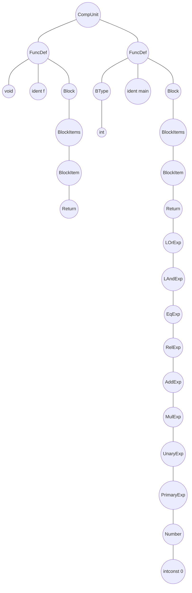

lab1/void_return.sy

```mermaid
graph TD
  0((CompUnit))
  0---1
  1((FuncDef))
  1---2
  2((void ))
  1---3
  3((ident f))
  1---4
  4((Block))
  4---5
  5((BlockItems))
  5---6
  6((BlockItem))
  6---7
  7((Return ))
  0---8
  8((FuncDef))
  8---9
  9((BType))
  9---10
  10((int ))
  8---11
  11((ident main))
  8---12
  12((Block))
  12---13
  13((BlockItems))
  13---14
  14((BlockItem))
  14---15
  15((Return))
  15---16
  16((LOrExp))
  16---17
  17((LAndExp))
  17---18
  18((EqExp))
  18---19
  19((RelExp))
  19---20
  20((AddExp))
  20---21
  21((MulExp))
  21---22
  22((UnaryExp))
  22---23
  23((PrimaryExp))
  23---24
  24((Number))
  24---25
  25((intconst 0))
```
