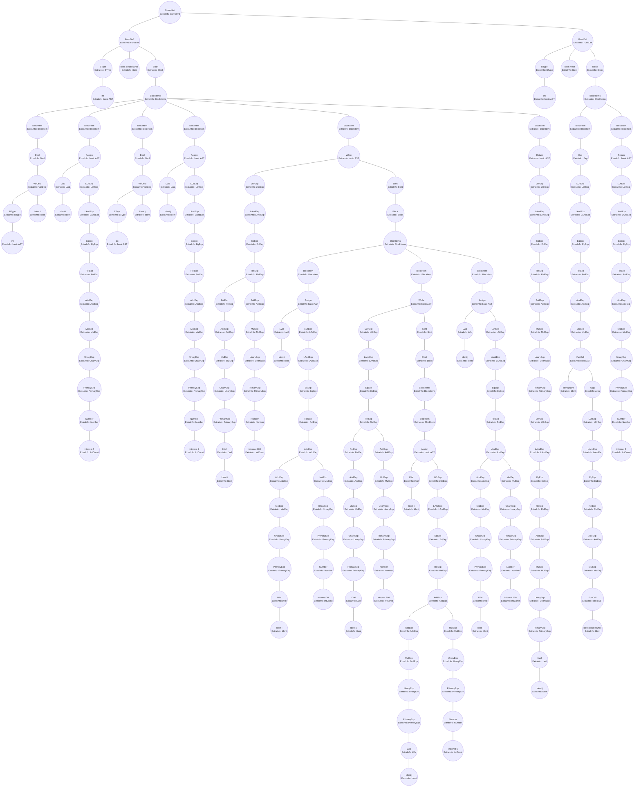

lab1/while_test1.sy

```mermaid
graph TD
  0((CompUnit
ExtraInfo: CompUnit))
  0---1
  1((FuncDef
ExtraInfo: FuncDef))
  1---2
  2((BType
ExtraInfo: BType))
  2---3
  3((int 
ExtraInfo: basic AST))
  1---4
  4((Ident doubleWhile
ExtraInfo: Ident))
  1---5
  5((Block
ExtraInfo: Block))
  5---6
  6((BlockItems
ExtraInfo: BlockItems))
  6---7
  7((BlockItem
ExtraInfo: BlockItem))
  7---8
  8((Decl
ExtraInfo: Decl))
  8---9
  9((VarDecl
ExtraInfo: VarDecl))
  9---10
  10((BType
ExtraInfo: BType))
  10---11
  11((int 
ExtraInfo: basic AST))
  9---12
  12((Ident i
ExtraInfo: Ident))
  6---13
  13((BlockItem
ExtraInfo: BlockItem))
  13---14
  14((Assign
ExtraInfo: basic AST))
  14---15
  15((LVal
ExtraInfo: LVal))
  15---16
  16((Ident i
ExtraInfo: Ident))
  14---17
  17((LOrExp
ExtraInfo: LOrExp))
  17---18
  18((LAndExp
ExtraInfo: LAndExp))
  18---19
  19((EqExp
ExtraInfo: EqExp))
  19---20
  20((RelExp
ExtraInfo: RelExp))
  20---21
  21((AddExp
ExtraInfo: AddExp))
  21---22
  22((MulExp
ExtraInfo: MulExp))
  22---23
  23((UnaryExp
ExtraInfo: UnaryExp))
  23---24
  24((PrimaryExp
ExtraInfo: PrimaryExp))
  24---25
  25((Number
ExtraInfo: Number))
  25---26
  26((intconst 5
ExtraInfo: IntConst))
  6---27
  27((BlockItem
ExtraInfo: BlockItem))
  27---28
  28((Decl
ExtraInfo: Decl))
  28---29
  29((VarDecl
ExtraInfo: VarDecl))
  29---30
  30((BType
ExtraInfo: BType))
  30---31
  31((int 
ExtraInfo: basic AST))
  29---32
  32((Ident j
ExtraInfo: Ident))
  6---33
  33((BlockItem
ExtraInfo: BlockItem))
  33---34
  34((Assign
ExtraInfo: basic AST))
  34---35
  35((LVal
ExtraInfo: LVal))
  35---36
  36((Ident j
ExtraInfo: Ident))
  34---37
  37((LOrExp
ExtraInfo: LOrExp))
  37---38
  38((LAndExp
ExtraInfo: LAndExp))
  38---39
  39((EqExp
ExtraInfo: EqExp))
  39---40
  40((RelExp
ExtraInfo: RelExp))
  40---41
  41((AddExp
ExtraInfo: AddExp))
  41---42
  42((MulExp
ExtraInfo: MulExp))
  42---43
  43((UnaryExp
ExtraInfo: UnaryExp))
  43---44
  44((PrimaryExp
ExtraInfo: PrimaryExp))
  44---45
  45((Number
ExtraInfo: Number))
  45---46
  46((intconst 7
ExtraInfo: IntConst))
  6---47
  47((BlockItem
ExtraInfo: BlockItem))
  47---48
  48((While
ExtraInfo: basic AST))
  48---49
  49((LOrExp
ExtraInfo: LOrExp))
  49---50
  50((LAndExp
ExtraInfo: LAndExp))
  50---51
  51((EqExp
ExtraInfo: EqExp))
  51---52
  52((RelExp
ExtraInfo: RelExp))
  52---53
  53((RelExp
ExtraInfo: RelExp))
  53---54
  54((AddExp
ExtraInfo: AddExp))
  54---55
  55((MulExp
ExtraInfo: MulExp))
  55---56
  56((UnaryExp
ExtraInfo: UnaryExp))
  56---57
  57((PrimaryExp
ExtraInfo: PrimaryExp))
  57---58
  58((LVal
ExtraInfo: LVal))
  58---59
  59((Ident i
ExtraInfo: Ident))
  52---60
  60((AddExp
ExtraInfo: AddExp))
  60---61
  61((MulExp
ExtraInfo: MulExp))
  61---62
  62((UnaryExp
ExtraInfo: UnaryExp))
  62---63
  63((PrimaryExp
ExtraInfo: PrimaryExp))
  63---64
  64((Number
ExtraInfo: Number))
  64---65
  65((intconst 100
ExtraInfo: IntConst))
  48---66
  66((Stmt
ExtraInfo: Stmt))
  66---67
  67((Block
ExtraInfo: Block))
  67---68
  68((BlockItems
ExtraInfo: BlockItems))
  68---69
  69((BlockItem
ExtraInfo: BlockItem))
  69---70
  70((Assign
ExtraInfo: basic AST))
  70---71
  71((LVal
ExtraInfo: LVal))
  71---72
  72((Ident i
ExtraInfo: Ident))
  70---73
  73((LOrExp
ExtraInfo: LOrExp))
  73---74
  74((LAndExp
ExtraInfo: LAndExp))
  74---75
  75((EqExp
ExtraInfo: EqExp))
  75---76
  76((RelExp
ExtraInfo: RelExp))
  76---77
  77((AddExp
ExtraInfo: AddExp))
  77---78
  78((AddExp
ExtraInfo: AddExp))
  78---79
  79((MulExp
ExtraInfo: MulExp))
  79---80
  80((UnaryExp
ExtraInfo: UnaryExp))
  80---81
  81((PrimaryExp
ExtraInfo: PrimaryExp))
  81---82
  82((LVal
ExtraInfo: LVal))
  82---83
  83((Ident i
ExtraInfo: Ident))
  77---84
  84((MulExp
ExtraInfo: MulExp))
  84---85
  85((UnaryExp
ExtraInfo: UnaryExp))
  85---86
  86((PrimaryExp
ExtraInfo: PrimaryExp))
  86---87
  87((Number
ExtraInfo: Number))
  87---88
  88((intconst 30
ExtraInfo: IntConst))
  68---89
  89((BlockItem
ExtraInfo: BlockItem))
  89---90
  90((While
ExtraInfo: basic AST))
  90---91
  91((LOrExp
ExtraInfo: LOrExp))
  91---92
  92((LAndExp
ExtraInfo: LAndExp))
  92---93
  93((EqExp
ExtraInfo: EqExp))
  93---94
  94((RelExp
ExtraInfo: RelExp))
  94---95
  95((RelExp
ExtraInfo: RelExp))
  95---96
  96((AddExp
ExtraInfo: AddExp))
  96---97
  97((MulExp
ExtraInfo: MulExp))
  97---98
  98((UnaryExp
ExtraInfo: UnaryExp))
  98---99
  99((PrimaryExp
ExtraInfo: PrimaryExp))
  99---100
  100((LVal
ExtraInfo: LVal))
  100---101
  101((Ident j
ExtraInfo: Ident))
  94---102
  102((AddExp
ExtraInfo: AddExp))
  102---103
  103((MulExp
ExtraInfo: MulExp))
  103---104
  104((UnaryExp
ExtraInfo: UnaryExp))
  104---105
  105((PrimaryExp
ExtraInfo: PrimaryExp))
  105---106
  106((Number
ExtraInfo: Number))
  106---107
  107((intconst 100
ExtraInfo: IntConst))
  90---108
  108((Stmt
ExtraInfo: Stmt))
  108---109
  109((Block
ExtraInfo: Block))
  109---110
  110((BlockItems
ExtraInfo: BlockItems))
  110---111
  111((BlockItem
ExtraInfo: BlockItem))
  111---112
  112((Assign
ExtraInfo: basic AST))
  112---113
  113((LVal
ExtraInfo: LVal))
  113---114
  114((Ident j
ExtraInfo: Ident))
  112---115
  115((LOrExp
ExtraInfo: LOrExp))
  115---116
  116((LAndExp
ExtraInfo: LAndExp))
  116---117
  117((EqExp
ExtraInfo: EqExp))
  117---118
  118((RelExp
ExtraInfo: RelExp))
  118---119
  119((AddExp
ExtraInfo: AddExp))
  119---120
  120((AddExp
ExtraInfo: AddExp))
  120---121
  121((MulExp
ExtraInfo: MulExp))
  121---122
  122((UnaryExp
ExtraInfo: UnaryExp))
  122---123
  123((PrimaryExp
ExtraInfo: PrimaryExp))
  123---124
  124((LVal
ExtraInfo: LVal))
  124---125
  125((Ident j
ExtraInfo: Ident))
  119---126
  126((MulExp
ExtraInfo: MulExp))
  126---127
  127((UnaryExp
ExtraInfo: UnaryExp))
  127---128
  128((PrimaryExp
ExtraInfo: PrimaryExp))
  128---129
  129((Number
ExtraInfo: Number))
  129---130
  130((intconst 6
ExtraInfo: IntConst))
  68---131
  131((BlockItem
ExtraInfo: BlockItem))
  131---132
  132((Assign
ExtraInfo: basic AST))
  132---133
  133((LVal
ExtraInfo: LVal))
  133---134
  134((Ident j
ExtraInfo: Ident))
  132---135
  135((LOrExp
ExtraInfo: LOrExp))
  135---136
  136((LAndExp
ExtraInfo: LAndExp))
  136---137
  137((EqExp
ExtraInfo: EqExp))
  137---138
  138((RelExp
ExtraInfo: RelExp))
  138---139
  139((AddExp
ExtraInfo: AddExp))
  139---140
  140((AddExp
ExtraInfo: AddExp))
  140---141
  141((MulExp
ExtraInfo: MulExp))
  141---142
  142((UnaryExp
ExtraInfo: UnaryExp))
  142---143
  143((PrimaryExp
ExtraInfo: PrimaryExp))
  143---144
  144((LVal
ExtraInfo: LVal))
  144---145
  145((Ident j
ExtraInfo: Ident))
  139---146
  146((MulExp
ExtraInfo: MulExp))
  146---147
  147((UnaryExp
ExtraInfo: UnaryExp))
  147---148
  148((PrimaryExp
ExtraInfo: PrimaryExp))
  148---149
  149((Number
ExtraInfo: Number))
  149---150
  150((intconst 100
ExtraInfo: IntConst))
  6---151
  151((BlockItem
ExtraInfo: BlockItem))
  151---152
  152((Return
ExtraInfo: basic AST))
  152---153
  153((LOrExp
ExtraInfo: LOrExp))
  153---154
  154((LAndExp
ExtraInfo: LAndExp))
  154---155
  155((EqExp
ExtraInfo: EqExp))
  155---156
  156((RelExp
ExtraInfo: RelExp))
  156---157
  157((AddExp
ExtraInfo: AddExp))
  157---158
  158((MulExp
ExtraInfo: MulExp))
  158---159
  159((UnaryExp
ExtraInfo: UnaryExp))
  159---160
  160((PrimaryExp
ExtraInfo: PrimaryExp))
  160---161
  161((LOrExp
ExtraInfo: LOrExp))
  161---162
  162((LAndExp
ExtraInfo: LAndExp))
  162---163
  163((EqExp
ExtraInfo: EqExp))
  163---164
  164((RelExp
ExtraInfo: RelExp))
  164---165
  165((AddExp
ExtraInfo: AddExp))
  165---166
  166((MulExp
ExtraInfo: MulExp))
  166---167
  167((UnaryExp
ExtraInfo: UnaryExp))
  167---168
  168((PrimaryExp
ExtraInfo: PrimaryExp))
  168---169
  169((LVal
ExtraInfo: LVal))
  169---170
  170((Ident j
ExtraInfo: Ident))
  0---171
  171((FuncDef
ExtraInfo: FuncDef))
  171---172
  172((BType
ExtraInfo: BType))
  172---173
  173((int 
ExtraInfo: basic AST))
  171---174
  174((Ident main
ExtraInfo: Ident))
  171---175
  175((Block
ExtraInfo: Block))
  175---176
  176((BlockItems
ExtraInfo: BlockItems))
  176---177
  177((BlockItem
ExtraInfo: BlockItem))
  177---178
  178((Exp
ExtraInfo: Exp))
  178---179
  179((LOrExp
ExtraInfo: LOrExp))
  179---180
  180((LAndExp
ExtraInfo: LAndExp))
  180---181
  181((EqExp
ExtraInfo: EqExp))
  181---182
  182((RelExp
ExtraInfo: RelExp))
  182---183
  183((AddExp
ExtraInfo: AddExp))
  183---184
  184((MulExp
ExtraInfo: MulExp))
  184---185
  185((FunCall
ExtraInfo: basic AST))
  185---186
  186((Ident putint
ExtraInfo: Ident))
  185---187
  187((Args
ExtraInfo: Args))
  187---188
  188((LOrExp
ExtraInfo: LOrExp))
  188---189
  189((LAndExp
ExtraInfo: LAndExp))
  189---190
  190((EqExp
ExtraInfo: EqExp))
  190---191
  191((RelExp
ExtraInfo: RelExp))
  191---192
  192((AddExp
ExtraInfo: AddExp))
  192---193
  193((MulExp
ExtraInfo: MulExp))
  193---194
  194((FunCall
ExtraInfo: basic AST))
  194---195
  195((Ident doubleWhile
ExtraInfo: Ident))
  176---196
  196((BlockItem
ExtraInfo: BlockItem))
  196---197
  197((Return
ExtraInfo: basic AST))
  197---198
  198((LOrExp
ExtraInfo: LOrExp))
  198---199
  199((LAndExp
ExtraInfo: LAndExp))
  199---200
  200((EqExp
ExtraInfo: EqExp))
  200---201
  201((RelExp
ExtraInfo: RelExp))
  201---202
  202((AddExp
ExtraInfo: AddExp))
  202---203
  203((MulExp
ExtraInfo: MulExp))
  203---204
  204((UnaryExp
ExtraInfo: UnaryExp))
  204---205
  205((PrimaryExp
ExtraInfo: PrimaryExp))
  205---206
  206((Number
ExtraInfo: Number))
  206---207
  207((intconst 0
ExtraInfo: IntConst))
```
