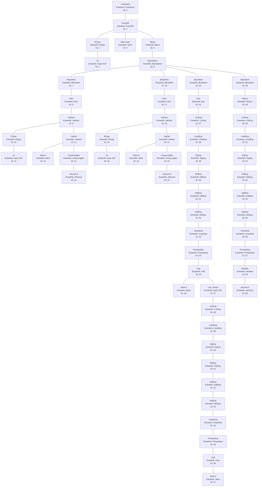

lab2/invalid_array2.sy

```mermaid
graph TD
  0[CompUnit
ExtraInfo: CompUnit
 ID: 0
]
  0---1
  1[FuncDef
ExtraInfo: FuncDef
 ID: 1
]
  1---2
  2[BType
ExtraInfo: BType
 ID: 2
]
  2---3
  3[int 
ExtraInfo: basic AST
 ID: 3
]
  1---4
  4[Ident main
ExtraInfo: Ident
 ID: 4
]
  1---5
  5[Block
ExtraInfo: Block
 ID: 5
]
  5---6
  6[BlockItems
ExtraInfo: BlockItems
 ID: 6
]
  6---7
  7[BlockItem
ExtraInfo: BlockItem
 ID: 7
]
  7---8
  8[Decl
ExtraInfo: Decl
 ID: 8
]
  8---9
  9[VarDecl
ExtraInfo: VarDecl
 ID: 9
]
  9---10
  10[BType
ExtraInfo: BType
 ID: 10
]
  10---11
  11[int 
ExtraInfo: basic AST
 ID: 11
]
  9---12
  12[VarDef
ExtraInfo: VarDef
 ID: 12
]
  12---13
  13[Ident a
ExtraInfo: Ident
 ID: 13
]
  12---14
  14[ArrayLengths
ExtraInfo: ArrayLengths
 ID: 14
]
  14---15
  15[intconst 5
ExtraInfo: IntConst
 ID: 15
]
  6---16
  16[BlockItem
ExtraInfo: BlockItem
 ID: 16
]
  16---17
  17[Decl
ExtraInfo: Decl
 ID: 17
]
  17---18
  18[VarDecl
ExtraInfo: VarDecl
 ID: 18
]
  18---19
  19[BType
ExtraInfo: BType
 ID: 19
]
  19---20
  20[int 
ExtraInfo: basic AST
 ID: 20
]
  18---21
  21[VarDef
ExtraInfo: VarDef
 ID: 21
]
  21---22
  22[Ident b
ExtraInfo: Ident
 ID: 22
]
  21---23
  23[ArrayLengths
ExtraInfo: ArrayLengths
 ID: 23
]
  23---24
  24[intconst 5
ExtraInfo: IntConst
 ID: 24
]
  6---25
  25[BlockItem
ExtraInfo: BlockItem
 ID: 25
]
  25---26
  26[Exp
ExtraInfo: Exp
 ID: 26
]
  26---27
  27[LOrExp
ExtraInfo: LOrExp
 ID: 27
]
  27---28
  28[LAndExp
ExtraInfo: LAndExp
 ID: 28
]
  28---29
  29[EqExp
ExtraInfo: EqExp
 ID: 29
]
  29---30
  30[RelExp
ExtraInfo: RelExp
 ID: 30
]
  30---31
  31[AddExp
ExtraInfo: AddExp
 ID: 31
]
  31---32
  32[MulExp
ExtraInfo: MulExp
 ID: 32
]
  32---33
  33[UnaryExp
ExtraInfo: UnaryExp
 ID: 33
]
  33---34
  34[PrimaryExp
ExtraInfo: PrimaryExp
 ID: 34
]
  34---35
  35[LVal
ExtraInfo: LVal
 ID: 35
]
  35---36
  36[Ident a
ExtraInfo: Ident
 ID: 36
]
  35---37
  37[Lval_Arrays
ExtraInfo: basic AST
 ID: 37
]
  37---38
  38[LOrExp
ExtraInfo: LOrExp
 ID: 38
]
  38---39
  39[LAndExp
ExtraInfo: LAndExp
 ID: 39
]
  39---40
  40[EqExp
ExtraInfo: EqExp
 ID: 40
]
  40---41
  41[RelExp
ExtraInfo: RelExp
 ID: 41
]
  41---42
  42[AddExp
ExtraInfo: AddExp
 ID: 42
]
  42---43
  43[MulExp
ExtraInfo: MulExp
 ID: 43
]
  43---44
  44[UnaryExp
ExtraInfo: UnaryExp
 ID: 44
]
  44---45
  45[PrimaryExp
ExtraInfo: PrimaryExp
 ID: 45
]
  45---46
  46[LVal
ExtraInfo: LVal
 ID: 46
]
  46---47
  47[Ident b
ExtraInfo: Ident
 ID: 47
]
  6---48
  48[BlockItem
ExtraInfo: BlockItem
 ID: 48
]
  48---49
  49[Return
ExtraInfo: Return
 ID: 49
]
  49---50
  50[LOrExp
ExtraInfo: LOrExp
 ID: 50
]
  50---51
  51[LAndExp
ExtraInfo: LAndExp
 ID: 51
]
  51---52
  52[EqExp
ExtraInfo: EqExp
 ID: 52
]
  52---53
  53[RelExp
ExtraInfo: RelExp
 ID: 53
]
  53---54
  54[AddExp
ExtraInfo: AddExp
 ID: 54
]
  54---55
  55[MulExp
ExtraInfo: MulExp
 ID: 55
]
  55---56
  56[UnaryExp
ExtraInfo: UnaryExp
 ID: 56
]
  56---57
  57[PrimaryExp
ExtraInfo: PrimaryExp
 ID: 57
]
  57---58
  58[Number
ExtraInfo: Number
 ID: 58
]
  58---59
  59[intconst 0
ExtraInfo: IntConst
 ID: 59
]
```
